# Device Info Module

## Overview

The Device Info module provides comprehensive system information collection capabilities for the Atlas platform. It implements a singleton-based service that gathers platform, CPU, memory, disk, and network information from the host system.

## Architecture

### System Architecture Diagram

```mermaid
graph TB
    %% Main service node
    A["🏗️ DeviceInfo<br/>Singleton Service"]
    
    %% Five main information collection modules
    B["🖥️ Platform Info<br/>Platform Information"]
    C["⚡ CPU Info<br/>CPU Information"]
    D["💾 Memory Info<br/>Memory Information"]
    E["💿 Disk Info<br/>Disk Information"]
    F["🌐 Network Info<br/>Network Information"]
    
    %% Platform info submodules
    B1["🔍 OS Detection<br/>Operating System"]
    B2["🆔 Machine ID<br/>Unique Identifier"]
    B3["📊 System Specs<br/>Hardware Specs"]
    
    %% CPU info submodules
    C1["🔧 CPU Details<br/>Processor Info"]
    C2["📈 Performance<br/>Metrics & Usage"]
    C3["🗄️ Cache Info<br/>Cache Hierarchy"]
    
    %% Memory info submodules
    D1["📊 Memory Usage<br/>RAM Statistics"]
    D2["🔄 Swap Info<br/>Virtual Memory"]
    D3["⚡ Buffer/Cache<br/>System Buffers"]
    
    %% Disk info submodules
    E1["📂 Partition Info<br/>Disk Partitions"]
    E2["📊 Disk Usage<br/>Storage Stats"]
    E3["⚡ I/O Statistics<br/>Read/Write Metrics"]
    
    %% Network info submodules
    F1["🔌 Interfaces<br/>Network Adapters"]
    F2["🌍 IP Information<br/>Network Config"]
    F3["🚀 Speed Tests<br/>Performance Tests"]
    
    %% Main connections
    A --> B
    A --> C
    A --> D
    A --> E
    A --> F
    
    %% Submodule connections
    B --> B1
    B --> B2
    B --> B3
    
    C --> C1
    C --> C2
    C --> C3
    
    D --> D1
    D --> D2
    D --> D3
    
    E --> E1
    E --> E2
    E --> E3
    
    F --> F1
    F --> F2
    F --> F3
    
    %% Style definitions
    classDef mainService fill:#2196F3,stroke:#1976D2,stroke-width:3px,color:#fff
    classDef platformModule fill:#4CAF50,stroke:#388E3C,stroke-width:2px,color:#fff
    classDef cpuModule fill:#FF9800,stroke:#F57C00,stroke-width:2px,color:#fff
    classDef memoryModule fill:#9C27B0,stroke:#7B1FA2,stroke-width:2px,color:#fff
    classDef diskModule fill:#F44336,stroke:#D32F2F,stroke-width:2px,color:#fff
    classDef networkModule fill:#00BCD4,stroke:#0097A7,stroke-width:2px,color:#fff
    classDef subModule fill:#E0E0E0,stroke:#9E9E9E,stroke-width:1px,color:#333
    
    %% Apply styles
    class A mainService
    class B platformModule
    class C cpuModule
    class D memoryModule
    class E diskModule
    class F networkModule
    class B1,B2,B3,C1,C2,C3,D1,D2,D3,E1,E2,E3,F1,F2,F3 subModule
```



### Data Flow Diagram

```mermaid
flowchart LR
    %% Input parameters
    START["🚀 Start Collection"]
    PARAMS["⚙️ Collection Params<br/>GetDeviceInfoParams"]
    
    %% Collection process
    COLLECT["🔄 Information Collector"]
    
    %% Module collection
    PLATFORM["🖥️ Platform Collection"]
    CPU["⚡ CPU Collection"]
    MEMORY["💾 Memory Collection"]
    DISK["💿 Disk Collection"]
    NETWORK["🌐 Network Collection"]
    
    %% Result aggregation
    AGGREGATE["📦 Result Aggregation"]
    RESULT["✅ Final Result<br/>GetDeviceInfoReturn"]
    
    %% Flow connections
    START --> PARAMS
    PARAMS --> COLLECT
    
    COLLECT --> PLATFORM
    COLLECT --> CPU
    COLLECT --> MEMORY
    COLLECT --> DISK
    COLLECT --> NETWORK
    
    PLATFORM --> AGGREGATE
    CPU --> AGGREGATE
    MEMORY --> AGGREGATE
    DISK --> AGGREGATE
    NETWORK --> AGGREGATE
    
    AGGREGATE --> RESULT
    
    %% Styles
    classDef startEnd fill:#4CAF50,stroke:#388E3C,stroke-width:2px,color:#fff
    classDef process fill:#2196F3,stroke:#1976D2,stroke-width:2px,color:#fff
    classDef collector fill:#FF9800,stroke:#F57C00,stroke-width:2px,color:#fff
    classDef result fill:#9C27B0,stroke:#7B1FA2,stroke-width:2px,color:#fff
    
    class START,RESULT startEnd
    class PARAMS,COLLECT,AGGREGATE process
    class PLATFORM,CPU,MEMORY,DISK,NETWORK collector
```



## Key Features

- **Cross-Platform Support**: Windows, Linux, and macOS
- **Comprehensive Information**: Platform, CPU, memory, disk, and network data
- **Selective Collection**: Choose which information to collect
- **Thread-Safe Singleton**: Single instance across the application
- **Error Resilience**: Graceful handling of unavailable information
- **Performance Optimized**: Efficient data collection with fallback mechanisms

## Usage Example

```python
from atlas.core._infra.device_info import DeviceInfo

# Get device info instance
device_info = DeviceInfo()

# Collect all information
result = device_info.get_device_info()

# Access collected data
print(f"OS: {result.platform.os_name}")
print(f"CPU: {result.cpu.brand_raw}")
print(f"Memory: {result.memory.total / (1024**3):.1f} GB")
```

## Documentation

- [**API Reference**](api-reference.md) - Complete API documentation

## Cross-Platform Compatibility

| Feature | Windows | Linux | macOS |
|---------|---------|-------|-------|
| Platform Info | ✅ | ✅ | ✅ |
| Machine ID | Registry | `/etc/machine-id` | IOKit UUID |
| CPU Info | ✅ | ✅ | ✅ |
| Memory Info | Basic | Extended | Basic |
| Disk Info | NTFS | All FS | APFS/HFS+ |
| Network Info | ✅ | ✅ | ✅ |
| Ping Test | Chinese/English | English | English |

## Performance Characteristics

- **Collection Time**: ~100-500ms for full system scan
- **Memory Usage**: <10MB during collection
- **Thread Safety**: Full thread-safe implementation
- **Caching**: Intelligent caching for expensive operations
- **Fallback**: Multiple fallback mechanisms for reliability