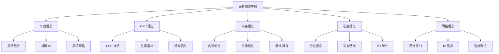

# 设备信息模块

## 概述

设备信息模块为 Atlas 平台提供全面的系统信息收集功能。它实现了一个基于单例模式的服务，用于收集主机系统的平台、CPU、内存、磁盘和网络信息。

## 架构

### 📊 交互式架构图表

<iframe src="../../../../assets/diagrams/device-info-architecture-zh.html" 
        width="100%" 
        height="600" 
        frameborder="0" 
        style="border: 1px solid #ddd; border-radius: 8px; margin: 20px 0;">
</iframe>

> 上方是可拖动的交互式架构图表。如果无法显示，请[点击这里](../../../../assets/diagrams/device-info-architecture-zh.html)在新窗口中打开。

### 静态架构图



## 核心特性

- **跨平台支持**: Windows、Linux 和 macOS
- **全面信息**: 平台、CPU、内存、磁盘和网络数据
- **选择性收集**: 选择要收集的信息类型
- **线程安全单例**: 应用程序中的单一实例
- **错误恢复**: 优雅处理不可用信息
- **性能优化**: 高效的数据收集和回退机制

## 使用示例

```python
from atlas.core._infra.device_info import DeviceInfo

# 获取设备信息实例
device_info = DeviceInfo()

# 收集所有信息
result = device_info.get_device_info()

# 访问收集的数据
print(f"操作系统: {result.platform.os_name}")
print(f"CPU: {result.cpu.brand_raw}")
print(f"内存: {result.memory.total / (1024**3):.1f} GB")
```

## 文档

- [**API 参考**](api-reference.md) - 完整的 API 文档

## 跨平台兼容性

| 功能 | Windows | Linux | macOS |
|------|---------|-------|-------|
| 平台信息 | ✅ | ✅ | ✅ |
| 机器 ID | 注册表 | `/etc/machine-id` | IOKit UUID |
| CPU 信息 | ✅ | ✅ | ✅ |
| 内存信息 | 基础 | 扩展 | 基础 |
| 磁盘信息 | NTFS | 所有文件系统 | APFS/HFS+ |
| 网络信息 | ✅ | ✅ | ✅ |
| Ping 测试 | 中英文 | 英文 | 英文 |

## 性能特征

- **收集时间**: 完整系统扫描约 100-500ms
- **内存使用**: 收集期间 <10MB
- **线程安全**: 完全线程安全实现
- **缓存**: 昂贵操作的智能缓存
- **回退**: 多重回退机制确保可靠性