# 设备信息模块

## 概述

设备信息模块为 Atlas 平台提供全面的系统信息收集功能。它实现了一个基于单例模式的服务，用于收集主机系统的平台、CPU、内存、磁盘和网络信息。

## 架构

### 系统架构图

```mermaid
graph TB
    %% 主服务节点
    A["🏗️ DeviceInfo<br/>单例服务"]
    
    %% 五大信息收集模块
    B["🖥️ 平台信息<br/>Platform Info"]
    C["⚡ CPU 信息<br/>CPU Info"]
    D["💾 内存信息<br/>Memory Info"]
    E["💿 磁盘信息<br/>Disk Info"]
    F["🌐 网络信息<br/>Network Info"]
    
    %% 平台信息子模块
    B1["🔍 系统检测<br/>OS Detection"]
    B2["🆔 机器 ID<br/>Machine ID"]
    B3["📊 系统规格<br/>System Specs"]
    
    %% CPU信息子模块
    C1["🔧 CPU 详情<br/>CPU Details"]
    C2["📈 性能指标<br/>Performance"]
    C3["🗄️ 缓存信息<br/>Cache Info"]
    
    %% 内存信息子模块
    D1["📊 内存使用<br/>Memory Usage"]
    D2["🔄 交换信息<br/>Swap Info"]
    D3["⚡ 缓冲/缓存<br/>Buffer/Cache"]
    
    %% 磁盘信息子模块
    E1["📂 分区信息<br/>Partition Info"]
    E2["📊 磁盘使用<br/>Disk Usage"]
    E3["⚡ I/O 统计<br/>I/O Statistics"]
    
    %% 网络信息子模块
    F1["🔌 网络接口<br/>Interfaces"]
    F2["🌍 IP 信息<br/>IP Information"]
    F3["🚀 速度测试<br/>Speed Tests"]
    
    %% 主要连接
    A --> B
    A --> C
    A --> D
    A --> E
    A --> F
    
    %% 子模块连接
    B --> B1
    B --> B2
    B --> B3
    
    C --> C1
    C --> C2
    C --> C3
    
    D --> D1
    D --> D2
    D --> D3
    
    E --> E1
    E --> E2
    E --> E3
    
    F --> F1
    F --> F2
    F --> F3
    
    %% 样式定义
    classDef mainService fill:#2196F3,stroke:#1976D2,stroke-width:3px,color:#fff
    classDef platformModule fill:#4CAF50,stroke:#388E3C,stroke-width:2px,color:#fff
    classDef cpuModule fill:#FF9800,stroke:#F57C00,stroke-width:2px,color:#fff
    classDef memoryModule fill:#9C27B0,stroke:#7B1FA2,stroke-width:2px,color:#fff
    classDef diskModule fill:#F44336,stroke:#D32F2F,stroke-width:2px,color:#fff
    classDef networkModule fill:#00BCD4,stroke:#0097A7,stroke-width:2px,color:#fff
    classDef subModule fill:#E0E0E0,stroke:#9E9E9E,stroke-width:1px,color:#333
    
    %% 应用样式
    class A mainService
    class B platformModule
    class C cpuModule
    class D memoryModule
    class E diskModule
    class F networkModule
    class B1,B2,B3,C1,C2,C3,D1,D2,D3,E1,E2,E3,F1,F2,F3 subModule
```



### 数据流程图

```mermaid
flowchart LR
    %% 输入参数
    START["🚀 开始收集"]
    PARAMS["⚙️ 收集参数<br/>GetDeviceInfoParams"]
    
    %% 收集过程
    COLLECT["🔄 信息收集器"]
    
    %% 各模块收集
    PLATFORM["🖥️ 平台信息收集"]
    CPU["⚡ CPU 信息收集"]
    MEMORY["💾 内存信息收集"]
    DISK["💿 磁盘信息收集"]
    NETWORK["🌐 网络信息收集"]
    
    %% 结果聚合
    AGGREGATE["📦 结果聚合"]
    RESULT["✅ 最终结果<br/>GetDeviceInfoReturn"]
    
    %% 流程连接
    START --> PARAMS
    PARAMS --> COLLECT
    
    COLLECT --> PLATFORM
    COLLECT --> CPU
    COLLECT --> MEMORY
    COLLECT --> DISK
    COLLECT --> NETWORK
    
    PLATFORM --> AGGREGATE
    CPU --> AGGREGATE
    MEMORY --> AGGREGATE
    DISK --> AGGREGATE
    NETWORK --> AGGREGATE
    
    AGGREGATE --> RESULT
    
    %% 样式
    classDef startEnd fill:#4CAF50,stroke:#388E3C,stroke-width:2px,color:#fff
    classDef process fill:#2196F3,stroke:#1976D2,stroke-width:2px,color:#fff
    classDef collector fill:#FF9800,stroke:#F57C00,stroke-width:2px,color:#fff
    classDef result fill:#9C27B0,stroke:#7B1FA2,stroke-width:2px,color:#fff
    
    class START,RESULT startEnd
    class PARAMS,COLLECT,AGGREGATE process
    class PLATFORM,CPU,MEMORY,DISK,NETWORK collector
```



## 核心特性

- **跨平台支持**: Windows、Linux 和 macOS
- **全面信息**: 平台、CPU、内存、磁盘和网络数据
- **选择性收集**: 选择要收集的信息类型
- **线程安全单例**: 应用程序中的单一实例
- **错误恢复**: 优雅处理不可用信息
- **性能优化**: 高效的数据收集和回退机制

## 使用示例

```python
from atlas.core._infra.device_info import DeviceInfo

# 获取设备信息实例
device_info = DeviceInfo()

# 收集所有信息
result = device_info.get_device_info()

# 访问收集的数据
print(f"操作系统: {result.platform.os_name}")
print(f"CPU: {result.cpu.brand_raw}")
print(f"内存: {result.memory.total / (1024**3):.1f} GB")
```

## 文档

- [**API 参考**](api-reference.md) - 完整的 API 文档

## 跨平台兼容性

| 功能 | Windows | Linux | macOS |
|------|---------|-------|-------|
| 平台信息 | ✅ | ✅ | ✅ |
| 机器 ID | 注册表 | `/etc/machine-id` | IOKit UUID |
| CPU 信息 | ✅ | ✅ | ✅ |
| 内存信息 | 基础 | 扩展 | 基础 |
| 磁盘信息 | NTFS | 所有文件系统 | APFS/HFS+ |
| 网络信息 | ✅ | ✅ | ✅ |
| Ping 测试 | 中英文 | 英文 | 英文 |

## 性能特征

- **收集时间**: 完整系统扫描约 100-500ms
- **内存使用**: 收集期间 <10MB
- **线程安全**: 完全线程安全实现
- **缓存**: 昂贵操作的智能缓存
- **回退**: 多重回退机制确保可靠性